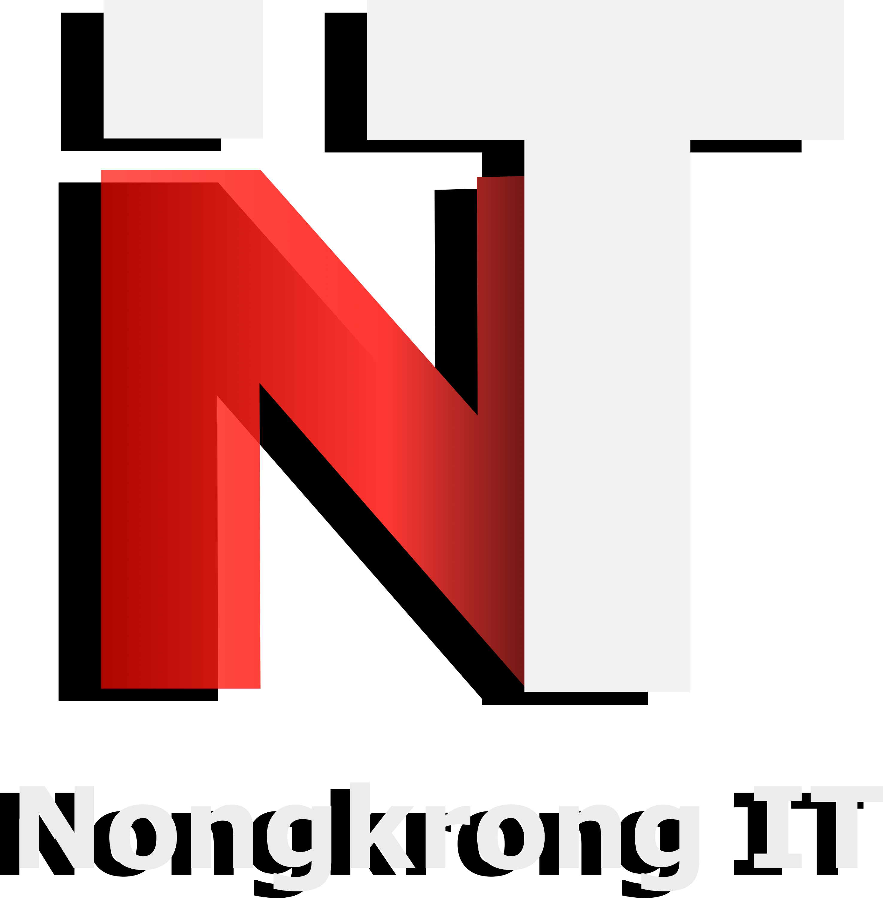

# Nongkrong IT Community

Welcome to the Nongkrong IT Community, a vibrant community operating within the campus of STMIK AMIK RIAU. While we are located within the campus, please note that Nongkrong IT is an independent community and is not officially affiliated with the university.

## Table of Contents

- [About](#about)
- [Getting Started](#getting-started)
- [Community Guidelines](#community-guidelines)
- [Contributing](#contributing)
- [Code of Conduct](#code-of-conduct)
- [Contact Us](#contact-us)

## About

Nongkrong IT is an inclusive and friendly community for individuals passionate about technology, operating within the STMIK AMIK RIAU campus. We provide a platform for members to:

- Learn and grow in their IT careers.
- Share knowledge and expertise.
- Collaborate on open-source projects.
- Engage in meaningful discussions about IT trends and topics.

While we are located within the campus, our community is open to all, and we welcome members from both within and outside the university.

## Getting Started

To get started with Nongkrong IT, follow these steps:

1. Explore our [GitHub Repositories](https://github.com/nongkrongit) to find open-source projects and contribute to them.
2. Follow us on [Instagram](https://www.instagram.com/nongkrong_it/) to stay updated on community events and announcements.

## Community Guidelines

We expect all community members to adhere to our [Community Guidelines](./CONTRIBUTING.md) to ensure a respectful and positive environment for everyone, regardless of their affiliation with students STMIK AMIK RIAU.

## Contributing

We encourage members to contribute to our community in various ways, such as:

- **Open Source:** Contribute to open-source projects hosted in our GitHub repositories.
- **Knowledge Sharing:** Share your knowledge through articles, tutorials, or talks.
- **Discussions:** Engage in discussions on our forum and Discord server.
- **Events:** Participate in community events, workshops, and webinars.

Please refer to our [Contributing Guidelines](./CONTRIBUTING.md) for more details on how you can get involved.

## Code of Conduct

We have a strict [Code of Conduct](./CODE_OF_CONDUCT.md) that all community members, contributors, and moderators must follow. It outlines our expectations for behavior within the community and provides guidelines for resolving conflicts.

## Contact Us

If you have any questions, concerns, or suggestions, feel free to contact us:

- **Email:** org.nongkrongit@gmail.com

We look forward to having you as part of the Nongkrong IT community, whether you're a student of STMIK AMIK RIAU or simply interested in IT!
